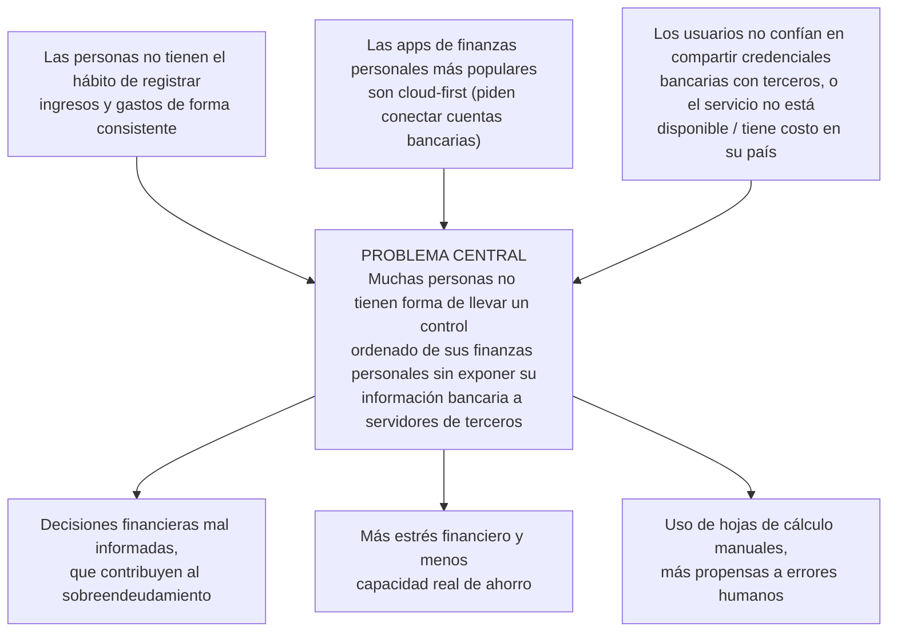

# Plan del proyecto — Fase 1

Ver también: [[Cursos/QA/entregables/mapeo-modulos-firefly-iii|Mapeo de módulos — Firefly III]] · [[Cursos/QA/entregables/seleccion-repositorio-proyecto|Selección de repositorio]] · [[Cursos/QA/entregables/reparto-equipo-fase1-fase2|Reparto de trabajo — Fase 1 y 2]] · [[Cursos/QA/apuntes/proyecto-qa-guia|Guía del Proyecto]] · [[Cursos/QA/entregas]]

**Estado: entregado (2026-09-09)**, según los 11 ítems de la estructura oficial (ver [[Cursos/QA/apuntes/proyecto-qa-guia]]), incluyendo requerimientos + HU con CA, diagrama del árbol de problemas y las 3 fuentes bibliográficas.

**Repositorio elegido:** [firefly-iii/firefly-iii](https://github.com/firefly-iii/firefly-iii), un gestor de finanzas personales de código abierto y autohospedado, hecho en Laravel/PHP con Vue en el frontend. La justificación completa de por qué se eligió está en [[Cursos/QA/entregables/seleccion-repositorio-proyecto]].

---

*A partir de aquí, el contenido sigue el orden exacto de los 11 ítems oficiales (ver [[Cursos/QA/apuntes/proyecto-qa-guia]]). Los tres primeros ítems (Portada, Tabla de contenidos, Índice de tablas) llevan campos marcados como `[COMPLETAR: ...]` porque necesitan datos que no están en este vault (nombre completo de cada integrante, grupo, nombre de la profesora) — el resto del documento ya está redactado.*

## Portada

- **Institución:** [COMPLETAR: nombre completo del TEC / sede]
- **Escuela / Carrera:** [COMPLETAR]
- **Curso:** Calidad de Software (QA) — [COMPLETAR: código del curso]
- **Profesora:** [COMPLETAR: nombre completo]
- **Grupo:** [COMPLETAR: número de grupo]
- **Proyecto:** Plan del proyecto — Fase 1, aplicado a Firefly III
- **Integrantes del equipo:**
  - [COMPLETAR: nombre completo — carné] (Persona 1 — Auth + Profile)
  - [COMPLETAR: nombre completo — carné] (Persona 2 — Transaction + Category)
  - [COMPLETAR: nombre completo — carné] (Persona 3 — Account + Budget)
- **Fecha de entrega:** 9 de septiembre de 2026

## Tabla de contenidos

*(Lista manual del contenido; al exportar a Word, generar la tabla de contenidos real con la función automática de Word sobre los estilos de título — Word numera las páginas solo, esta lista es la referencia de qué debe quedar en el índice.)*

1. Portada
2. Tabla de contenidos
3. Índice de tablas
4. Introducción
   - 4.1 Qué
   - 4.2 Por qué
   - 4.3 Cómo
   - 4.4 Limitaciones
5. Especificaciones del software
6. Descripción de requerimientos o historias de usuario
   - 6.1 Requerimientos funcionales
   - 6.2 Requerimientos no funcionales
   - 6.3 Historias de usuario y criterios de aceptación
7. Problema
8. Objetivos, metas e indicadores
   - 8.1 Objetivo general
   - 8.2 Objetivos específicos, metas e indicadores
9. Recursos disponibles
10. Cronograma de actividades
11. Conclusiones y recomendaciones
12. Referencias bibliográficas (IEEE)
13. Anexos

## Índice de tablas

| Tabla | Título | Página |
|---|---|---|
| Tabla 1 | Objetivos específicos, metas e indicadores | [COMPLETAR al paginar en Word] |
| Tabla 2 | Cronograma de actividades | [COMPLETAR al paginar en Word] |

## Introducción

### Qué

Este proyecto aplica los procesos de calidad de software que se han visto en el curso (planeación, verificación y validación) sobre Firefly III, un gestor de finanzas personales de código abierto y autohospedado. En esta edición del curso el proyecto no se hace sobre una empresa real con contraparte, sino sobre un repositorio de GitHub elegido por el equipo (ver la corrección al respecto en [[Cursos/QA/apuntes/proyecto-qa-guia]]). El equipo escogió Firefly III siguiendo los 9 criterios que pidió la profesora, descritos en [[Cursos/QA/apuntes/criterios-seleccion-repositorio-github]].

### Por qué

La gestión de las finanzas personales es un problema con impacto social real. No llevar un registro claro de los ingresos y los gastos es uno de los factores que más contribuye al sobreendeudamiento, y aplicaciones como la estudiada en [1] muestran que todavía hay una necesidad activa de herramientas que ayuden a las personas a organizar su presupuesto y entender su situación financiera. Buena parte de las aplicaciones de finanzas personales más usadas hoy en día piden conectar las cuentas bancarias a servidores externos para funcionar, lo que genera fricción para quien no quiere compartir información tan sensible con un tercero y lo deja sin muchas alternativas si igual quiere llevar el control de su dinero.

Firefly III responde a ese problema porque es completamente autohospedado: los datos financieros nunca salen del servidor del propio usuario. Eso lo convierte en una opción real para quienes les preocupa la privacidad de su información financiera, algo que las aplicaciones que dependen de la nube no ofrecen. Incluso las aplicaciones de finanzas personales que sí dependen de la nube reconocen que proteger esta información no es opcional: herramientas recientes como la descrita en [3] destacan el cifrado y el cumplimiento de protocolos de seguridad como un requisito central de diseño, precisamente porque manejan datos financieros sensibles. Lo mismo aplica, con mayor razón, a una herramienta autohospedada como Firefly III, donde no hay un proveedor externo que audite el servicio y la responsabilidad de que esos mecanismos funcionen bien recae directamente sobre pruebas como las de este proyecto.

Y validar que una herramienta así funcione bien no es un detalle menor: como señalan [2] al hablar de los problemas más comunes en aseguramiento de la calidad, una prueba mal planificada o incompleta deja pasar defectos que después tienen consecuencias reales, y en este caso esas consecuencias caen directo sobre las decisiones financieras de la persona que usa la herramienta (un error en el cálculo de saldos, presupuestos o transacciones recurrentes).

### Cómo

El proyecto sigue las 5 fases del curso. Primero la identificación del problema y la definición de objetivos, que es esta misma fase y se entrega en la semana 6. Luego la planeación, donde se construye el plan de pruebas con al menos 60 casos y 3 tipos de prueba distintos, que se entrega en la semana 11. Después viene el diseño, desarrollo y evaluación, donde se automatiza al menos el 90% de esos casos de prueba y se documentan los defectos encontrados en un informe, entregables que caen entre la semana 15 y la 16. La comunicación de resultados es una presentación en inglés en la semana 16. Y en paralelo a todo esto corre la fase de reflexión, que es el diario individual desde la semana 2 hasta la 16 y se lleva aparte de este documento.

### Limitaciones

El equipo trabaja sobre el código tal como está publicado en el repositorio. No hay acceso a datos de usuarios reales en producción, solo a datos de prueba generados localmente. El alcance principal de las pruebas se limita a los 6 módulos de alta prioridad que se identificaron en [[Cursos/QA/entregables/mapeo-modulos-firefly-iii]] (autenticación, perfil/2FA, cuentas, transacciones, presupuestos y categorías) — los mismos que ya sirvieron de base para repartir el trabajo de la Fase 2 entre el equipo (ver [[Cursos/QA/entregables/reparto-equipo-fase1-fase2]]). Los módulos de media prioridad (facturas, recurrentes, reglas y piggy banks) quedan como alcance opcional: solo se documentan e incluyen en el Plan de pruebas si a alguien le faltan casos para llegar a su cuota. Los módulos administrativos o de soporte como Admin, Webhooks o Export quedan fuera del alcance por completo. Tampoco hay una contraparte de negocio que valide los requerimientos: estos se sacaron del comportamiento observado y documentado del sistema, no de una entrevista con alguien del proyecto real.

## Especificaciones del software

Firefly III corre sobre PHP 8.5 o superior, con el framework Laravel en su versión 13. El frontend está en transición entre dos interfaces: la interfaz nueva (v2) usa Vite y Bootstrap 5, mientras que buena parte de las pantallas todavía activas siguen corriendo sobre la interfaz anterior (v1), construida con Vue 2.7 y Bootstrap 3. Esto es relevante para el proyecto porque significa que no toda la aplicación se puede tratar como una sola SPA moderna a la hora de automatizar pruebas de interfaz: hay pantallas servidas por Blade con islas de Vue 2 y pantallas más nuevas hechas con Vite.

Como base de datos, la configuración oficial de Docker usa MySQL (variable `DB_CONNECTION=mysql` en el `.env` de ejemplo del repo). El despliegue se hace con el `docker-compose` oficial del proyecto, que el equipo ya probó y confirmó que funciona: los contenedores levantan sin problema y se puede iniciar sesión en `http://localhost/login` (verificado el 17 de agosto). No se encontró en el repositorio una lista oficial de navegadores soportados, así que eso queda pendiente de definir con criterio propio del equipo (los navegadores modernos más comunes: Chrome, Firefox y Edge en sus versiones actuales).

En cuanto a hardware, el repositorio no publica un requisito mínimo oficial. Por experiencia propia levantando el stack completo (contenedores de la aplicación, base de datos MySQL y caché) en la máquina de un integrante del equipo, alcanza con un equipo con al menos 4 GB de RAM libres para Docker y unos 2 GB de espacio en disco para las imágenes y los volúmenes. No hace falta hardware especial, cualquier laptop de desarrollo estándar del equipo es suficiente.

## Descripción de requerimientos o historias de usuario

Esta sección tiene dos niveles, verificados contra el código fuente del repositorio y no solo contra la documentación, y ambos salen del mapeo de módulos ([[Cursos/QA/entregables/mapeo-modulos-firefly-iii]]):

1. **Requerimientos** (funcionales RF-01 a RF-20, y no funcionales RNF-01 a RNF-06): qué debe hacer el sistema, en lenguaje normativo clásico ("el sistema debe...").
2. **Historias de usuario (HU) con criterios de aceptación (CA)**: cada RF funcional se opera mediante exactamente una HU con el mismo número (RF-01 → HU-01, RF-02 → HU-02, y así sucesivamente), que lo reformula desde la perspectiva de quien lo usa y lo desglosa en condiciones verificables.

La razón de tener los dos niveles, y no solo uno: el RF documenta el requerimiento como tal (lo que pide este ítem de la rúbrica), y la HU con sus CA es lo que se usa directamente como insumo para diseñar los ≥60 casos de prueba de la Fase 2 (ver [[Cursos/QA/entregables/reparto-equipo-fase1-fase2]]) — cada CA es candidato directo a uno o más casos de prueba (positivo, negativo o de valor límite). Con 20 HU de 3 CA cada una hay unos 60 CA en total, superficie de sobra para los 60 casos exigidos sin tener que inventar alcance sobre la marcha.

Los 20 RF/HU cubren únicamente los 6 módulos de alta prioridad (Auth, Profile, Account, Transaction, Budget, Category), agrupados por la misma división de trabajo que ya se acordó para la Fase 2. Los módulos de media prioridad no tienen RF/HU propios en esta entrega; si algún integrante necesita más casos para llegar a su cuota en la Fase 2, se agregan entonces.

### Requerimientos funcionales

**Auth + Profile:**
- **RF-01:** El sistema debe permitir a un usuario registrado iniciar sesión con correo y contraseña, rechazando credenciales inválidas y aplicando alguna protección contra fuerza bruta.
- **RF-02:** El sistema debe permitir a un visitante registrarse creando una cuenta con correo y contraseña, validando que el correo no esté duplicado y que la contraseña cumpla una política mínima de seguridad.
- **RF-03:** El sistema debe permitir recuperar el acceso a una cuenta mediante un mecanismo de restablecimiento de contraseña que expire después de un tiempo definido.
- **RF-04:** El sistema debe permitir cerrar sesión manualmente y debe expirar automáticamente las sesiones inactivas tras un período definido.
- **RF-05:** El sistema debe permitir activar y desactivar autenticación de dos factores (2FA) en el perfil del usuario, exigiendo el código correspondiente en el login cuando está activa.
- **RF-06:** El sistema debe permitir a un usuario eliminar su propia cuenta, definiendo de forma consistente qué ocurre con los datos asociados.

**Transaction + Category:**
- **RF-07:** El sistema debe permitir registrar una transacción de gasto desde una cuenta propia, actualizando el saldo de la cuenta origen y validando que el monto sea positivo.
- **RF-08:** El sistema debe permitir registrar una transacción de ingreso hacia una cuenta propia, actualizando el saldo de la cuenta destino y validando que el monto sea positivo.
- **RF-09:** El sistema debe permitir registrar una transferencia entre dos cuentas propias, manteniendo la consistencia contable de doble entrada.
- **RF-10:** El sistema debe permitir editar una transacción existente, recalculando correctamente los saldos afectados.
- **RF-11:** El sistema debe permitir eliminar una transacción existente, revirtiendo su efecto sobre los saldos afectados.
- **RF-12:** El sistema debe permitir registrar una transacción en una moneda distinta a la de la cuenta, aplicando la tasa de cambio vigente para la conversión.
- **RF-13:** El sistema debe permitir crear categorías y asignar una categoría a cada transacción.
- **RF-14:** El sistema debe permitir filtrar las transacciones registradas por categoría, opcionalmente combinado con un rango de fechas.

**Account + Budget:**
- **RF-15:** El sistema debe permitir crear una cuenta financiera especificando un tipo válido (activo, pasivo, gasto o ingreso) y una moneda.
- **RF-16:** El sistema debe permitir editar los datos de una cuenta financiera existente (nombre, tipo, moneda).
- **RF-17:** El sistema debe permitir eliminar una cuenta financiera, definiendo un comportamiento consistente cuando tiene transacciones asociadas.
- **RF-18:** El sistema debe permitir definir un presupuesto con un monto límite para una categoría y un período específicos.
- **RF-19:** El sistema debe calcular y mostrar el monto disponible restante de un presupuesto, recalculándolo cada vez que cambian las transacciones de esa categoría dentro del período.
- **RF-20:** El sistema debe permitir editar o eliminar un presupuesto existente sin alterar las transacciones ya registradas en esa categoría.

### Requerimientos no funcionales

Estos son de sistema, no de usuario final, por eso no tienen una HU asociada:

- **RNF-01 — Despliegue:** el sistema debe poder desplegarse localmente con Docker, usando el `docker-compose` oficial, sin depender de servicios externos no documentados.
- **RNF-02 — Interoperabilidad:** el sistema debe exponer una API REST que cubra las operaciones de los 20 RF anteriores, para poder automatizar pruebas más allá de la interfaz web.
- **RNF-03 — Aislamiento de datos:** el sistema debe aislar correctamente los datos financieros entre distintos usuarios o grupos de usuarios (UserGroup).
- **RNF-04 — Seguridad de credenciales:** las contraseñas de los usuarios deben almacenarse con un algoritmo de hash seguro (no en texto plano), verificable inspeccionando el esquema de la base de datos.
- **RNF-05 — Compatibilidad:** la interfaz debe funcionar correctamente en las versiones actuales de Chrome, Firefox y Edge (el repositorio no publica una lista oficial de navegadores soportados, ver [[#Especificaciones del software]]).
- **RNF-06 — Rendimiento:** las operaciones principales (login, registrar transacción, consultar presupuesto) deben responder en un tiempo razonable bajo el uso normal de un solo usuario; el umbral exacto se termina de definir en la Fase 2, ya que el repositorio no publica un SLA oficial.

### Historias de usuario y criterios de aceptación

#### Auth + Profile (Persona 1)

**HU-01 — Iniciar sesión** *(implementa RF-01 — Alta — Auth)*
Como usuario registrado, quiero iniciar sesión con mi correo y contraseña, para acceder a mis datos financieros.
- CA1: Con credenciales válidas, el sistema autentica al usuario y lo redirige al dashboard.
- CA2: Con correo inexistente o contraseña incorrecta, el sistema rechaza el acceso con un mensaje genérico, sin revelar cuál de los dos datos es el incorrecto.
- CA3: Después de varios intentos fallidos consecutivos, el sistema aplica alguna medida contra fuerza bruta (bloqueo temporal o captcha).

**HU-02 — Registrar una cuenta de usuario nueva** *(implementa RF-02 — Alta — Auth)*
Como visitante, quiero crear una cuenta de usuario con correo y contraseña, para poder empezar a usar el sistema.
- CA1: El sistema rechaza el registro si el correo ya está en uso.
- CA2: El sistema exige una contraseña que cumpla una política mínima de seguridad (longitud, complejidad) y rechaza contraseñas que no la cumplan.
- CA3: Tras un registro exitoso, el usuario queda en un estado desde el que puede iniciar sesión inmediatamente o requiere un paso de verificación, según lo que defina el sistema.

**HU-03 — Recuperar una contraseña olvidada** *(implementa RF-03 — Alta — Auth)*
Como usuario registrado que olvidó su contraseña, quiero solicitar un restablecimiento, para volver a acceder a mi cuenta.
- CA1: Al solicitar el restablecimiento con un correo válido, el sistema envía o genera un mecanismo de reseteo (enlace o token).
- CA2: Al solicitar el restablecimiento con un correo que no existe, el sistema no revela si el correo está registrado o no.
- CA3: El mecanismo de reseteo expira después de un tiempo y no puede reutilizarse una vez usado.

**HU-04 — Cerrar sesión y expiración de sesión** *(implementa RF-04 — Alta — Auth)*
Como usuario autenticado, quiero que mi sesión se cierre cuando yo lo pida o cuando pase demasiado tiempo inactivo, para que nadie más acceda a mis datos desde mi sesión.
- CA1: Al cerrar sesión manualmente, el sistema invalida el token/sesión activa y exige volver a autenticarse.
- CA2: Después de un período de inactividad definido, el sistema expira la sesión automáticamente.
- CA3: Con una sesión ya expirada, cualquier intento de operación protegida es rechazado y redirige a login.

**HU-05 — Activar y usar autenticación de dos factores (2FA)** *(implementa RF-05 — Alta — Profile)*
Como usuario preocupado por la seguridad de mis datos financieros, quiero activar 2FA en mi perfil, para agregar una capa extra de protección al inicio de sesión.
- CA1: Al activar 2FA, el sistema genera un secreto/QR compatible con una app estándar de autenticación (TOTP).
- CA2: Con 2FA activo, el login exige el código de la app además de la contraseña, y rechaza el acceso si el código es incorrecto o expiró.
- CA3: El usuario puede desactivar 2FA desde su perfil, con una confirmación adicional (contraseña o código vigente).

**HU-06 — Eliminar mi cuenta de usuario** *(implementa RF-06 — Media — Profile, caso destructivo)*
Como usuario, quiero poder eliminar mi cuenta y mis datos, para dejar de usar el sistema sin dejar información mía activa.
- CA1: El sistema pide una confirmación explícita antes de ejecutar el borrado (es una acción irreversible).
- CA2: Tras la eliminación, el usuario ya no puede iniciar sesión con esas credenciales.
- CA3: El sistema define y respeta qué pasa con los datos asociados (cuentas, transacciones) al eliminar al usuario — se documenta el comportamiento real encontrado al probarlo.

#### Transaction + Category (Persona 2)

**HU-07 — Registrar una transacción de gasto** *(implementa RF-07 — Alta — Transaction)*
Como usuario, quiero registrar un gasto desde una cuenta propia, para llevar el control de en qué se me va el dinero.
- CA1: Al registrar un gasto válido, el saldo de la cuenta origen disminuye en el monto exacto de la transacción.
- CA2: El sistema rechaza un gasto con monto negativo, cero, o sin cuenta origen.
- CA3: El gasto queda visible en el historial de transacciones de la cuenta, con fecha, monto y descripción.

**HU-08 — Registrar una transacción de ingreso** *(implementa RF-08 — Alta — Transaction)*
Como usuario, quiero registrar un ingreso hacia una cuenta propia, para reflejar el dinero que recibo.
- CA1: Al registrar un ingreso válido, el saldo de la cuenta destino aumenta en el monto exacto.
- CA2: El sistema rechaza un ingreso con monto negativo, cero, o sin cuenta destino.
- CA3: El ingreso queda visible en el historial de transacciones con su tipo correctamente identificado (deposit).

**HU-09 — Registrar una transferencia entre cuentas propias** *(implementa RF-09 — Alta — Transaction)*
Como usuario, quiero mover dinero entre dos cuentas mías, para reorganizar mi dinero sin que se cuente como gasto ni ingreso real.
- CA1: Al transferir, el saldo de la cuenta origen disminuye y el de la cuenta destino aumenta en el mismo monto, manteniendo la consistencia de doble entrada.
- CA2: El sistema rechaza una transferencia donde origen y destino son la misma cuenta.
- CA3: El sistema rechaza una transferencia si la cuenta origen o destino no existen o no pertenecen al usuario.

**HU-10 — Editar una transacción existente** *(implementa RF-10 — Alta — Transaction)*
Como usuario, quiero corregir el monto, la fecha o la categoría de una transacción ya registrada, para arreglar un error de captura.
- CA1: Al editar el monto, los saldos de las cuentas involucradas se recalculan correctamente reflejando solo la diferencia.
- CA2: El sistema valida los nuevos datos igual que en el registro original (no permite dejar el monto en cero o negativo donde no corresponde).
- CA3: El historial de la transacción refleja el cambio (o al menos el estado final correcto), sin duplicar el efecto sobre el saldo.

**HU-11 — Eliminar una transacción** *(implementa RF-11 — Alta — Transaction)*
Como usuario, quiero borrar una transacción que registré por error, para que no afecte mis saldos ni mis reportes.
- CA1: Al eliminar, el saldo de la(s) cuenta(s) involucradas revierte exactamente el efecto de esa transacción.
- CA2: El sistema pide confirmación antes de eliminar.
- CA3: La transacción eliminada deja de aparecer en el historial y en los reportes agregados.

**HU-12 — Registrar una transacción en una moneda distinta a la de la cuenta** *(implementa RF-12 — Media — Transaction / TransactionCurrency)*
Como usuario con cuentas en distintas monedas, quiero registrar una transacción usando una moneda distinta a la de la cuenta, para no tener que convertir el monto manualmente.
- CA1: El sistema aplica la tasa de cambio vigente para convertir el monto a la moneda de la cuenta antes de afectar el saldo.
- CA2: El sistema rechaza o advierte si no hay una tasa de cambio disponible para el par de monedas.
- CA3: El monto convertido respeta la precisión decimal esperada (sin errores de redondeo visibles).

**HU-13 — Crear categorías y asignarlas a una transacción** *(implementa RF-13 — Alta — Category)*
Como usuario, quiero clasificar mis transacciones por categoría (ej. comida, transporte), para entender en qué se me va el dinero por tipo de gasto.
- CA1: El sistema permite crear una categoría nueva con un nombre no vacío y único para el usuario.
- CA2: Una transacción puede asignarse a una sola categoría a la vez.
- CA3: El sistema rechaza crear una categoría con nombre duplicado (mismo nombre, mismo usuario).

**HU-14 — Filtrar transacciones por categoría** *(implementa RF-14 — Media — Category)*
Como usuario, quiero ver solo las transacciones de una categoría específica, para revisar cuánto gasté en algo en particular.
- CA1: El filtro devuelve únicamente las transacciones asignadas a la categoría seleccionada.
- CA2: Si la categoría no tiene transacciones asociadas, el sistema muestra una lista vacía, no un error.
- CA3: El filtro se puede combinar con un rango de fechas.

#### Account + Budget (Persona 3)

**HU-15 — Crear una cuenta financiera** *(implementa RF-15 — Alta — Account)*
Como usuario, quiero crear una cuenta financiera de un tipo específico (activo, pasivo, gasto o ingreso), para empezar a registrar transacciones sobre ella.
- CA1: El sistema exige un nombre y un tipo de cuenta válidos para crearla.
- CA2: El sistema rechaza crear una cuenta sin moneda asignada (o le asigna una moneda por defecto documentada).
- CA3: La cuenta nueva aparece disponible de inmediato como origen/destino al registrar una transacción.

**HU-16 — Editar una cuenta financiera** *(implementa RF-16 — Alta — Account)*
Como usuario, quiero editar el nombre, tipo o moneda de una cuenta existente, para corregir datos mal configurados.
- CA1: Al editar el nombre, el cambio se refleja en el historial de transacciones asociadas sin duplicar la cuenta.
- CA2: El sistema valida los nuevos datos igual que en la creación (tipo válido, nombre no vacío).
- CA3: Cambiar la moneda de una cuenta con transacciones existentes tiene un comportamiento definido y consistente (se documenta el que se encuentre al probar: conversión, bloqueo, o advertencia).

**HU-17 — Eliminar una cuenta financiera** *(implementa RF-17 — Media — Account, caso destructivo)*
Como usuario, quiero eliminar una cuenta que ya no uso, para mantener ordenada mi lista de cuentas.
- CA1: El sistema pide confirmación antes de eliminar una cuenta.
- CA2: Si la cuenta tiene transacciones asociadas, el sistema define un comportamiento consistente (impedir el borrado, reasignarlas, o eliminarlas en cascada) y lo aplica siempre igual.
- CA3: Una cuenta eliminada deja de estar disponible como origen/destino para transacciones nuevas.

**HU-18 — Definir un presupuesto por categoría y período** *(implementa RF-18 — Alta — Budget)*
Como usuario, quiero definir un límite de gasto para una categoría en un período determinado, para controlar cuánto gasto en ese rubro.
- CA1: El sistema exige un monto positivo y un período (fecha inicio/fin o recurrencia) válidos para crear el presupuesto.
- CA2: El sistema rechaza un presupuesto con monto negativo o cero.
- CA3: Un mismo presupuesto no puede duplicarse para la misma categoría y el mismo período exacto.

**HU-19 — Consultar el monto disponible restante de un presupuesto** *(implementa RF-19 — Alta — Budget)*
Como usuario, quiero ver cuánto me queda disponible de un presupuesto según lo que ya gasté, para decidir si puedo seguir gastando en esa categoría.
- CA1: El disponible mostrado es igual al límite del presupuesto menos la suma de las transacciones de esa categoría dentro del período.
- CA2: Al registrar, editar o eliminar una transacción de esa categoría dentro del período, el disponible se recalcula de inmediato.
- CA3: Si el gasto supera el límite, el sistema refleja un disponible negativo (o lo señala como excedido) en vez de truncarlo en cero silenciosamente.

**HU-20 — Editar o eliminar un presupuesto** *(implementa RF-20 — Media — Budget)*
Como usuario, quiero ajustar o borrar un presupuesto que ya no aplica, para mantener mi planificación financiera actualizada.
- CA1: Al editar el monto límite, el disponible restante se recalcula con el nuevo límite.
- CA2: Al eliminar un presupuesto, las transacciones ya registradas en esa categoría no se eliminan ni se alteran.
- CA3: El sistema pide confirmación antes de eliminar un presupuesto.

## Problema

El problema central que motiva este proyecto es que muchas personas no tienen forma de llevar un control ordenado de sus finanzas personales sin exponer su información bancaria a servidores de terceros. Esto no es solo un problema técnico: tiene un lado educativo, porque buena parte de la población nunca recibió formación formal en manejo de presupuesto personal, y un lado económico, porque las decisiones financieras mal informadas afectan directamente la capacidad de ahorro y la salud financiera de los hogares.

**Causas**, de la más general a la más puntual:
- Las personas no tienen el hábito de registrar sus ingresos y gastos de forma consistente.
- Las aplicaciones de finanzas personales más populares están construidas sobre un modelo cloud first, donde hay que conectar las cuentas bancarias directamente a los servidores de la empresa que ofrece el servicio.
- Muchos usuarios evitan usar esas aplicaciones porque no confían en compartir sus credenciales bancarias con un tercero, o porque el servicio simplemente no está disponible o tiene costo en su país.

**Efectos**, partiendo del problema hacia lo más general:
- Quien no lleva un control de sus finanzas tiende a tomar decisiones financieras mal informadas, lo que contribuye al sobreendeudamiento.
- Esto se traduce en más estrés financiero y menos capacidad real de ahorro.
- Como alternativa, muchas personas terminan usando hojas de cálculo manuales, que son más propensas a errores humanos que una herramienta pensada para eso.

Este árbol de problemas se construyó siguiendo la metodología del taller de la profesora (ver [[Cursos/QA/apuntes/taller-arbol-problemas-objetivos]]). El diagrama visual:

*(Nota para quien exporte a Word: este bloque es Mermaid, se renderiza nativo en Obsidian pero Word no lo interpreta — hay que exportarlo como imagen, ej. abriendo esta nota en Obsidian y capturando el diagrama renderizado, o pegando el código en el editor en vivo de mermaid.live y descargando el PNG/SVG desde ahí.)*

## Objetivos

### Objetivo general

Evaluar la calidad del software de Firefly III aplicando un proceso de pruebas (planeación, diseño, ejecución y análisis de resultados) sobre sus módulos financieros críticos, con el fin de determinar qué tanto cumple sus requerimientos funcionales y detectar los defectos que pueda tener.

### Objetivos específicos, metas e indicadores

**Tabla 1.** Objetivos específicos, metas e indicadores

| Objetivo específico | Metas | Indicadores |
|---|---|---|
| Analizar los requerimientos funcionales de los módulos de alta prioridad de Firefly III para delimitar el alcance de las pruebas | Revisar el código fuente de cada módulo (no solo la documentación); consultar con el equipo cuáles módulos de media prioridad quedan como respaldo | Documento de requerimientos completo antes de la semana 6, con 20 RF/HU sobre los 6 módulos de alta prioridad |
| Diseñar un plan de pruebas con al menos 60 casos, cubriendo 3 tipos de prueba distintos, con un máximo de 10% de casos manuales | Definir las técnicas de prueba a usar; escribir cada caso con el formato que dio la profesora | 60 o más casos de prueba definidos antes de la semana 11; 3 tipos de prueba distintos aplicados; 90% o más de los casos marcados como automatizables |
| Automatizar al menos el 90% de los casos de prueba diseñados | Elegir el framework de pruebas adecuado al stack (PHP/Laravel) o trabajar directo contra la API REST; escribir y correr las pruebas automatizadas | 90% o más de los 60+ casos ejecutándose de forma automática antes de la semana 15 |
| Ejecutar el plan de pruebas y documentar los defectos encontrados en un informe de pruebas | Correr todas las pruebas automatizadas; registrar cada defecto en el formato de fichas dado por la profesora | Informe de pruebas entregado en la semana 16, con todos los defectos encontrados descritos y con evidencia |
| Comunicar los resultados del proyecto en una presentación en inglés | Preparar la presentación y ensayarla como equipo antes de la fecha | Presentación de 20 minutos más 10 de preguntas, dentro del tiempo pactado, en la semana 16 |

## Recursos disponibles

El equipo cuenta con los siguientes recursos para llevar a cabo el proyecto:

- **Humanos:** los integrantes del equipo (3 a 4 personas según lo que pide el curso), cada uno con acceso a su propio entorno de desarrollo.
- **Infraestructura:** cada integrante puede levantar Firefly III localmente con Docker, usando el `docker-compose` oficial del proyecto, ya probado y funcionando desde el 17 de agosto.
- **Herramientas:** GitHub para el control de versiones y coordinación del equipo, y el framework de pruebas que se termine de elegir en la Fase 2 según el stack del repositorio (Laravel/PHP) o pruebas directas contra la API REST.
- **Tiempo:** desde ahora (semana 5) hasta la semana 16, repartido entre las cinco fases del curso.
- **Acceso a la información:** el código fuente completo del repositorio está disponible públicamente en GitHub, junto con sus issues, historial de commits y documentación.

## Cronograma de actividades

**Tabla 2.** Cronograma de actividades

| Semana | Fechas (2026)                    | Actividad                                                                                                                                                         |
| ------ | -------------------------------- | ----------------------------------------------------------------------------------------------------------------------------------------------------------------- |
| 5      | 31 de agosto al 6 de septiembre  | Terminar de revisar y validar este Plan del proyecto en equipo; completar el formato (portada, tabla de contenidos, índice de tablas)                             |
| 6      | 7 al 13 de septiembre            | **Entrega del Plan del proyecto** (miércoles 9 de septiembre)                                                                                                     |
| 7      | 14 al 20 de septiembre           | Elegir las técnicas de prueba a usar y empezar a escribir los primeros casos de prueba                                                                            |
| 8      | 21 al 27 de septiembre           | Seguir escribiendo casos de prueba, meta de tener al menos la mitad de los 60 definidos                                                                           |
| 9      | 28 de septiembre al 4 de octubre | Terminar de escribir los 60 o más casos de prueba, cubriendo los 3 tipos de prueba distintos                                                                      |
| 10     | 5 al 11 de octubre               | Revisar y validar el Plan de pruebas en equipo antes de entregarlo                                                                                                |
| 11     | 12 al 18 de octubre              | **Entrega del Plan de pruebas** (miércoles 14 de octubre)                                                                                                         |
| 12     | 19 al 25 de octubre              | Elegir el framework de automatización y dejar el entorno de pruebas configurado                                                                                   |
| 13     | 26 de octubre al 1 de noviembre  | Automatizar el primer bloque de casos de prueba                                                                                                                   |
| 14     | 2 al 8 de noviembre              | Terminar de automatizar la suite completa (meta: 90% o más de los casos) y empezar a documentar los defectos encontrados                                          |
| 15     | 9 al 15 de noviembre             | **Entrega del Proyecto de pruebas** (miércoles 11 de noviembre)                                                                                                   |
| 16     | 16 al 22 de noviembre            | Terminar el Informe de pruebas, preparar y ensayar la presentación en inglés. **Entrega del Informe de pruebas y de la Presentación** (miércoles 18 de noviembre) |

## Conclusiones y recomendaciones

Firefly III es un proyecto adecuado para aplicar los procesos de calidad de software del curso porque combina un problema social real (privacidad y control de las finanzas personales) con un sistema técnicamente lo bastante complejo como para dar suficientes casos de prueba: cálculos financieros, autenticación con 2FA, reglas condicionales y soporte multi moneda, entre otros. El principal riesgo que el equipo identifica hasta ahora es que el mantenimiento del repositorio está bastante concentrado en un solo desarrollador, lo que podría dificultar reportar o dar seguimiento a algún hallazgo si hiciera falta, aunque para el propósito del curso (aplicar QA sobre el código ya existente) esto no debería ser un problema real.

## Referencias bibliográficas (IEEE)

[1] T. Stefanov, M. Stefanova, S. Varbanova, and S. Temelkov, "Personal Finance Management Application," *TEM Journal*, vol. 13, no. 3, pp. 2066-2075, Aug. 2024.

[2] M. Salahat, R. A. Said, K. Hamid, U. Haseeb, E. Abdel Maguid Abdel Ghani, A. Abualkishik, M. W. Iqbal, and M. Inairat, "Software Testing Issues Improvement in Quality Assurance," in *2023 2nd International Conference on Business Analytics for Technology and Security (ICBATS)*, 2023, doi: 10.1109/ICBATS57792.2023.10111145.

[3] N. Shailendra, C. Parvathi, S. Gupta, and G. Ravikumar, "Money Map: The Personal Finance Tracker," in *2025 International Conference on Knowledge Engineering and Communication Systems (ICKECS)*, 2025, pp. 1-4, doi: 10.1109/ICKECS65700.2025.11035699.

## Anexos

*(No es un ítem que puntúe en la rúbrica oficial de este entregable, pero se deja la sección por si el equipo quiere agregar algo, como capturas de la app corriendo localmente.)*

## Pendiente

- [x] Especificaciones del software (hardware y software)
- [x] Problema (árbol de problemas en texto y diagrama visual Mermaid)
- [x] Objetivos específicos con tabla de metas e indicadores (Tabla 1)
- [x] Recursos disponibles
- [x] Cronograma de actividades, semana por semana con fechas (Tabla 2)
- [x] Citas en el texto ([1], [2] y [3] citadas en la Introducción, no solo listadas en Referencias)
- [x] Sincronizar la fecha de entrega a Todoist y Calendar (hecho 2026-08-29)
- [x] Expandir "Requerimientos del sistema" a 20 requerimientos funcionales (RF) + 6 no funcionales (RNF) + 20 historias de usuario con criterios de aceptación, trazables 1 a 1 (RF-0N → HU-0N), sobre los 6 módulos de alta prioridad (2026-09-08, a partir de la observación del equipo de que faltaban requerimientos para este ítem, que vale 25/100 en la rúbrica)
- [x] Confirmar la tercera fuente bibliográfica: "Money Map: The Personal Finance Tracker" (ICKECS 2025, IEEE, DOI 10.1109/ICKECS65700.2025.11035699) — verificada vía Crossref y Semantic Scholar, no solo por el título (2026-09-08)
- [x] Agregar Portada, Tabla de contenidos e Índice de tablas como secciones propias del documento (2026-09-08) — la Portada queda con campos `[COMPLETAR]` porque necesita nombres reales del equipo, la profesora y el grupo, que no están en este vault
- [x] Pasar el árbol de problemas a un diagrama visual real (Mermaid, con nota de cómo exportarlo a imagen para Word)
- [ ] **Llenar los `[COMPLETAR]` de la Portada** con los datos reales del equipo (nombres completos + carné de cada integrante), la profesora y el grupo — esto es lo único que de verdad falta y solo Marcos/el equipo lo tiene
- [ ] Revisión y validación del equipo sobre todo el contenido — visto bueno final antes de entregar el 2026-09-09
- [ ] Al exportar a Word: generar la tabla de contenidos real con la función automática de Word (estilos de título) y paginar el índice de tablas; exportar el diagrama Mermaid como imagen (Obsidian o mermaid.live)
