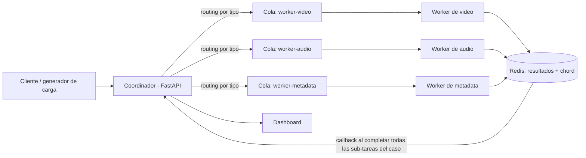

# Propuesta de desarrollo — I Proyecto Programado (plataforma multimedia por casos)

Ver también: [[Cursos/SistemasOperativos/apuntes/proyecto-programado-1-plataforma-multimedia|consigna completa]] · [[Cursos/SistemasOperativos/entregas]]

Documento para alinear con el equipo (somos 3) antes de arrancar. Entrega: **jueves 2026-10-01 (semana 9)**. Hoy es 2026-09-11, así que quedan ~3 semanas reales, con la Indagatoria (17 sep) y la I Prueba de Curso (24 sep) de por medio — el margen real de trabajo es más corto de lo que parece en el calendario.

## 1. Resumen de lo que hay que entregar

- Documento de arquitectura
- Repositorio de código
- Sistema funcional **distribuido en al menos 3 máquinas físicas** (una por integrante), o VMs/contenedores si no hay 3 equipos, siempre con separación real de procesos y comunicación por red
- Dashboard de monitoreo (por caso y por sub-tarea)
- Documentación técnica + manual de uso
- Informe de pruebas con evidencia de carga y distribución

La unidad de trabajo es el **caso**: uno o varios archivos (homogéneos o heterogéneos) sometidos como una sola solicitud, que el coordinador descompone en sub-tareas y cierra solo cuando todas terminan. Detalle completo en la consigna enlazada arriba.

## 2. Stack propuesto

| Componente | Propuesta | Por qué |
|---|---|---|
| Cola / broker | **Redis** | Simple de levantar, y es lo que necesita Celery de todos modos |
| Orquestación de tareas | **Celery** | Da *task routing* (mapea directo a workers especializados por tipo) y el primitivo `chord` (N tareas + callback cuando todas terminan) — resuelve el barrier/join de cierre de caso sin que nadie tenga que escribir un contador/lock a mano |
| Coordinador (API) | **FastAPI** (o Flask) | Recibe casos, expone estado por caso/sub-tarea, dispara los `chord` de Celery |
| Workers | Procesos Python separados por tipo (`worker-video`, `worker-audio`, `worker-metadata`), usando `ffmpeg` para conversión/extracción de audio/miniaturas | Especializados en vez de genéricos: da una justificación real y citable con la Unidad 1 (heterogeneidad de cómputo) para el rubro de arquitectura |
| Dashboard | **Streamlit** o un HTML simple servido por el mismo FastAPI | Pesa solo 5% de la rúbrica — no vale la pena invertir tiempo en algo elaborado |
| Red entre las 3 máquinas | **Tailscale** (o ZeroTier) | Evita pelear con NAT/firewalls de redes distintas; da IP estable a cada laptop en minutos |
| Repositorio de resultados | Carpeta compartida vía Tailscale, o Redis/SQLite con metadatos + archivos en disco de cada worker | A decidir en equipo, documentar la justificación |

El profesor confirmó que se permite usar librerías — no hace falta reimplementar la cola o el barrier/join a mano. Eso sí, en el documento de arquitectura hay que **explicar** qué hace Celery por debajo (el `chord` cuenta resultados en Redis de forma atómica), porque la rúbrica evalúa comprensión del principio, no solo que funcione.

## 3. Arquitectura (referencia)

Cada máquina física del equipo corre al menos un worker; el coordinador y Redis pueden vivir en cualquiera de las tres (o replicarse si da tiempo). Las tres deben verse entre sí por Tailscale.

## 4. Modelo de datos mínimo

- **Caso:** `id`, `archivos[]`, `estado` (`queued` → `processing` → `completed` / `partially_completed` / `failed` / `retrying` / `cancelled`), `creado_en`, `finalizado_en`.
- **SubTarea:** `id`, `caso_id`, `archivo`, `operación`, `estado` (`pendiente/asignado/en_ejecución/completado/fallido`), `worker`, `progreso`, `inicio`, `fin`, `resultado` o `error`.

El estado agregado del caso **solo se decide cuando están todas las sub-tareas resueltas** (ahí es donde entra el `chord`).

## 5. Reparto de trabajo propuesto (3 personas)

Es una propuesta de arranque, se ajusta según quién se sienta más cómodo con qué parte:

**Rol A — Coordinador y modelo de casos**
- API del coordinador (recibir caso, inspeccionar archivos, decidir operación por tipo)
- Modelo de datos Caso/SubTarea
- Integración de Celery `chord` para el cierre de caso
- Endpoints de estado (por caso y por sub-tarea) y reporte consolidado

**Rol B — Workers y procesamiento multimedia**
- Los 3 pools de workers especializados (video/audio/metadata) con `ffmpeg`
- Reporte de estado/resultado de cada sub-tarea al coordinador
- Repositorio de resultados (guardar y poder recuperar cada archivo procesado)

**Rol C — Infraestructura, dashboard y pruebas**
- Setup de Tailscale entre las 3 máquinas y despliegue de Redis + cada nodo
- Dashboard de monitoreo (estado por caso/sub-tarea, carga por worker)
- Cliente de pruebas / generador de carga (envío de casos concurrentes)
- Script de generación del dataset (400-600 archivos, casos homogéneos y heterogéneos) e informe de pruebas

Los tres deben poder explicar el sistema completo en la exposición, no solo su parte — el rubro de arquitectura y el de gestión de procesos se evalúan sobre el sistema entero.

## 6. Cronograma propuesto

| Semana | Fecha | Foco | Nota |
|---|---|---|---|
| Ahora | 11–14 sep | Alinear stack y roles con el equipo, crear repo, cada quien monta el entorno (Python, Redis, Celery) en su máquina, probar Tailscale entre las 3 | Resolver la conectividad entre máquinas de una vez, es lo más impredecible |
| Semana 7 | 15–21 sep | Coordinador + modelo de datos + un worker end-to-end en una sola máquina (caso homogéneo simple) | Choca con la Indagatoria (entrega 17 sep) — repartir bien el tiempo |
| Semana 8 | 22–28 sep | Distribuir en las 3 máquinas reales, task routing a los 3 tipos de worker, `chord` para casos heterogéneos, dashboard básico, script de dataset | Choca con la I Prueba de Curso (24 sep) |
| Semana 9 | 29 sep–1 oct | Integración, informe de pruebas con carga real, documentación técnica y manual, ensayo de la exposición | Entrega 01 oct (jueves) — dejar 1-2 días de colchón para bugs de última hora |

## 7. Preguntas abiertas para decidir en equipo

- ¿Repositorio de resultados: carpeta compartida vía Tailscale, o algo más estructurado (SQLite + rutas)?
- ¿Cómo se genera el dataset exactamente (qué fuente de archivos reales/CC se usa)?
- ¿Quién toma cada rol de la sección 5?
- ¿Reunión fija semanal, o coordinación async por chat?
