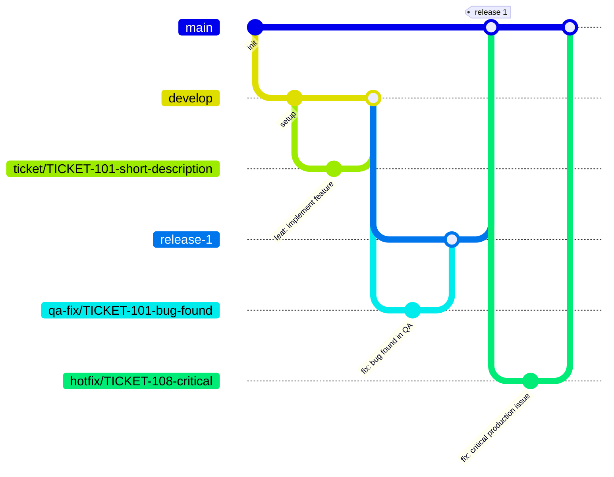

# Git workflow — {Project Name}

A branching model for teams that deliver in milestones rather than continuous deploy: work is integrated continuously on `develop`, but each milestone freezes into its own branch that goes through QA before reaching `main`.



## Branches and their purpose

| Branch | Branches from | Merges into | Purpose |
|---|---|---|---|
| `ticket/{TICKET-ID}-description` | `develop` | `develop` | A single user story/task (see `USER_STORIES.md`) |
| `develop` | — | `release-{N}` | Continuous integration of finished tickets |
| `release-{N}` | `develop` | `main` | Freezes the scope of a milestone/delivery; goes through QA before reaching `main` |
| `qa-fix/{TICKET-ID}-description` | `release-{N}` | `release-{N}` | Fixes bugs found while validating that specific milestone |
| `main` | — | — | What's already delivered/accepted |
| `hotfix/{TICKET-ID}-description` | `main` | `main` | Urgent fix on something already delivered, bypassing `develop`/`release-{N}` |

## Rules

- One branch = one ticket. The ticket ID always comes from the tracker (Jira or equivalent) / `USER_STORIES.md`, never invented on the spot.
- Bugs found in QA on a milestone go in `qa-fix/{TICKET-ID}-...` branched from that `release-{N}`, never committed directly on `release-{N}`.
- `release-{N}` only merges into `main` once QA approves it — that's what "delivering" means in this model.
- `hotfix/*` is the only branch type that comes directly from `main` — for something already delivered that breaks in production and can't wait for the next cycle. It never goes through `develop`/`release-{N}`.
- Semantic commits: `feat:`, `fix:`, `docs:`, `refactor:`, `test:`, `chore:`, with the ticket code in parentheses: `feat(TICKET-101): add feature`.
- If there is no ticket for the work yet, create it in the tracker first, then branch.
- Never commit or push directly to `main`, `develop`, or `release-{N}`. Everything enters through a PR.

## PR status labels

**The PR opens when the story starts, not when it's finished.** Every story a person owns in the current sprint has an open PR from the first moment, so the whole team can see on GitHub who is working on what. It opens even with no code yet: with the feature's spec, or with an empty commit (`git commit --allow-empty`). Label `in progress` if it's the story being worked on now, `on hold` if it can't start yet. The description is completed before moving it to `waiting qa`.

Every PR carries **exactly one** status label from the moment it is opened, added in the same command (`gh pr create --label "in progress" ...`). There is no "open it now, label it later".

| Label | Meaning | Who sets it | Tracker status |
|---|---|---|---|
| `in progress` | Still being worked on | Author | In Progress |
| `waiting qa` | Code complete, CI green, waiting for someone to test it | Author | Waiting QA |
| `qa accepted` | Tested and approved: ready to merge | Reviewer (never the author) | QA Accepted |
| `qa denied` | Problems found: back to the author | Reviewer | QA Denied |
| `on hold` | Blocked by something external, or waiting for another story to merge | Anyone | On Hold |

Flow: `in progress` → `waiting qa` → (`qa accepted` → merge) or (`qa denied` → back to `in progress`). `on hold` can replace any state. Labels replace each other, they never stack.

Rules:

- **Merge only with `qa accepted`**, set by someone who is not the author. An AI agent never sets `qa accepted` on its own work and never merges unless a person explicitly asks.
- **One PR `in progress` per person.** All of that person's other open PRs are `on hold`, `waiting qa`, `qa accepted`, or `qa denied`. To resume an `on hold` PR, first move the current one to another state.
- **No stacked branches.** If story B needs code from story A that is not in `develop` yet, B stays `on hold` until A gets `qa accepted` and merges; then B branches from the updated `develop`. Work on something else meanwhile.
- **Label and tracker always agree.** Every label change comes with the equivalent transition on the ticket, at the same moment. Check how the tracker models each state before writing it down (e.g. whether "On Hold" is a real status or just a flag on the card) and keep this table in sync with it.

These rules are enforced by `.github/workflows/gitflow.yml` (branch combinations, title format, exactly one label, one `in progress` per author) plus a `qa-gate` check that stays red until `qa accepted`. Make both checks required in the branch protection of `develop` and `main`.

## PR format

```markdown
## What it does


## How to test it


## Ticket link
(link)

## UI screenshots


## Test run screenshots

```

Rules for this format:
- "How to test it" gives manual repro steps even when automated tests exist — a reviewer who hasn't checked out the branch should be able to verify from the description alone.
- "Test run screenshots" means evidence from an actual automated test run (trace viewer, report, or terminal output showing a pass), not a UI screenshot duplicated under a different heading.
- The ticket link points to the actual ticket, never a paraphrase — the PR title still carries the ticket code (`feat(TICKET-101): ...`).
- This same format is already a GitHub-native template at `.github/PULL_REQUEST_TEMPLATE.md` — it pre-fills automatically when opening a PR.
