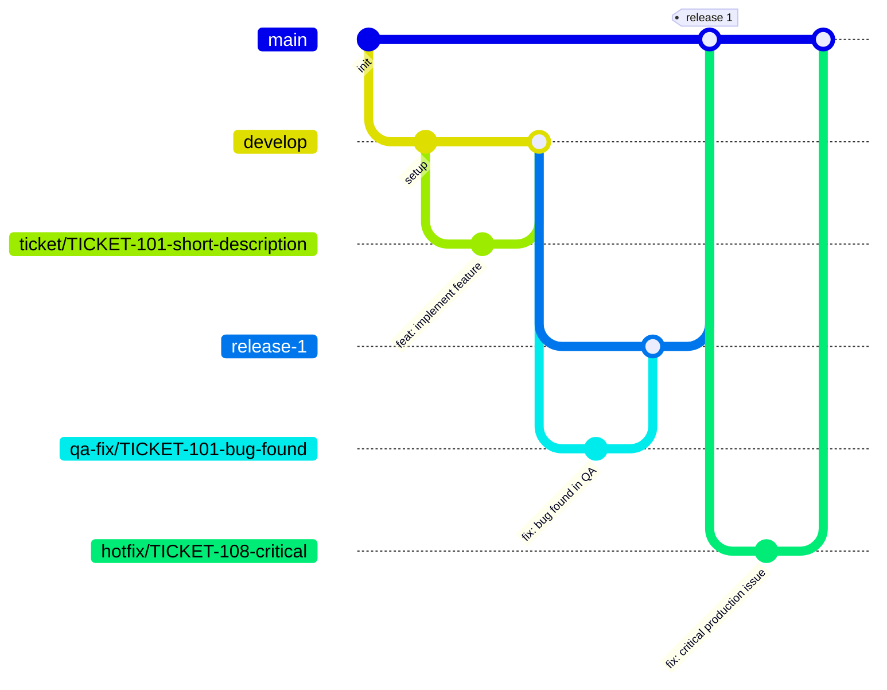

# Git workflow — {Project Name}

A branching model for teams that deliver in milestones rather than continuous deploy: work is integrated continuously on `develop`, but each milestone freezes into its own branch that goes through QA before reaching `main`.



## Branches and their purpose

| Branch | Branches from | Merges into | Purpose |
|---|---|---|---|
| `ticket/{TICKET-ID}-description` | `develop` | `develop` | A single user story/task (see `USER_STORIES.md`) |
| `develop` | — | `release-{N}` | Continuous integration of finished tickets |
| `release-{N}` | `develop` | `main` | Freezes the scope of a milestone/delivery; goes through QA before reaching `main` |
| `qa-fix/{TICKET-ID}-description` | `release-{N}` | `release-{N}` | Fixes bugs found while validating that specific milestone |
| `main` | — | — | What's already delivered/accepted |
| `hotfix/{TICKET-ID}-description` | `main` | `main` | Urgent fix on something already delivered, bypassing `develop`/`release-{N}` |

## Rules

- One branch = one ticket. The ticket ID always comes from the tracker (Jira or equivalent) / `USER_STORIES.md`, never invented on the spot.
- Bugs found in QA on a milestone go in `qa-fix/{TICKET-ID}-...` branched from that `release-{N}`, never committed directly on `release-{N}`.
- `release-{N}` only merges into `main` once QA approves it — that's what "delivering" means in this model.
- `hotfix/*` is the only branch type that comes directly from `main` — for something already delivered that breaks in production and can't wait for the next cycle. It never goes through `develop`/`release-{N}`.
- Semantic commits: `feat:`, `fix:`, `docs:`, `refactor:`, `test:`, `chore:`, with the ticket code in parentheses: `feat(TICKET-101): add feature`.

## PR format

```markdown
## What it does


## How to test it


## Ticket link
(link)

## UI screenshots


## Test run screenshots

```

Rules for this format:
- "How to test it" gives manual repro steps even when automated tests exist — a reviewer who hasn't checked out the branch should be able to verify from the description alone.
- "Test run screenshots" means evidence from an actual automated test run (trace viewer, report, or terminal output showing a pass), not a UI screenshot duplicated under a different heading.
- The ticket link points to the actual ticket, never a paraphrase — the PR title still carries the ticket code (`feat(TICKET-101): ...`).
- This same format is already a GitHub-native template at `.github/PULL_REQUEST_TEMPLATE.md` — it pre-fills automatically when opening a PR.
