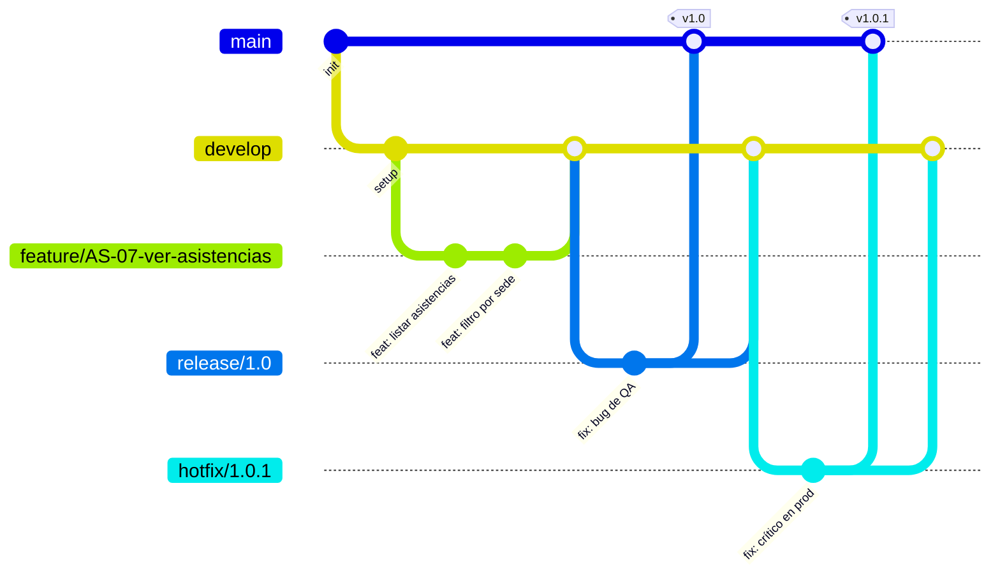
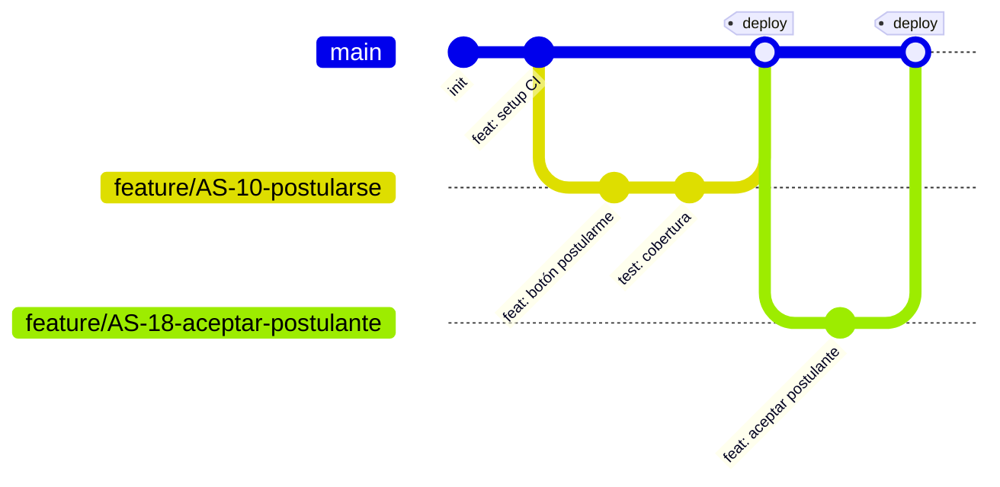
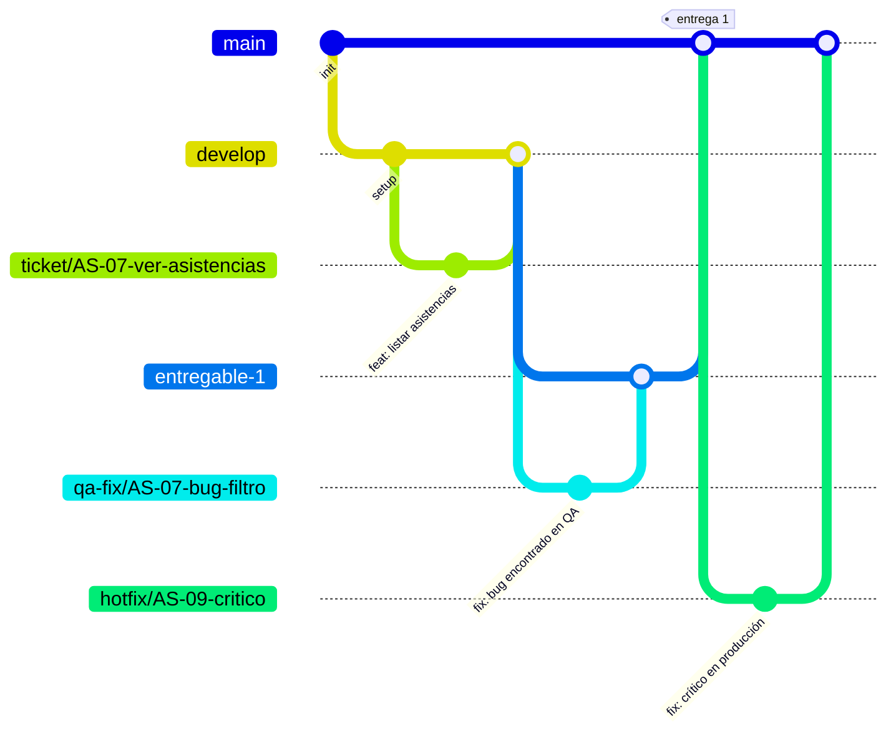

# Diagrama de manejo del repositorio (modelos de branching)

Ver también: [[Sistema/aprendizaje/README|Aprendizaje]] · [[Sistema/skills/gitflow-scrum/SKILL|gitflow-scrum]] · [[Sistema/proyecto-segundo-cerebro#6. Gitflow del curso — qué dice la evidencia 2026|análisis previo de Gitflow vs. trunk-based]]

"Manejo del repositorio" = qué ramas existen, cuándo se crean, hacia dónde apuntan los PR, y cuándo se borran. Esto no es un detalle menor de herramienta — es una decisión de **cultura de release**: cuánto confiás en tus tests determina cuánto tiempo puede vivir una rama sin integrarse.

## Modelo 1 — Gitflow clásico (Vincent Driessen, 2010)

Pensado para software con versiones/releases programados (ej. apps de escritorio, librerías con SemVer estricto).

**Ramas y su propósito:**

| Rama | Vive | Propósito |
|---|---|---|
| `main` | Para siempre | Solo código en producción, cada commit es una versión etiquetada (`v1.0`, `v1.0.1`) |
| `develop` | Para siempre | Integración de features listas para el próximo release, no necesariamente en producción todavía |
| `feature/*` | Días/semanas | Una funcionalidad, sale de `develop` y vuelve a `develop` |
| `release/*` | Días | Se corta de `develop` cuando se congela el alcance de una versión; solo fixes de último momento, no features nuevas |
| `hotfix/*` | Horas/días | Sale de `main` directo, para arreglar algo urgente en producción sin esperar el próximo release; se mergea a `main` **y** a `develop` |

**Costo real:** cinco tipos de rama y reglas de merge en ambas direcciones (`release`/`hotfix` mergean a dos lugares) es mucha ceremonia para un equipo chico sin releases programados. El consenso de la industria en 2026 es que Gitflow tiene sentido cuando hay versiones instalables con soporte de varias versiones a la vez (ej. una librería que da soporte a v1 y v2 en paralelo) — no para la mayoría de apps web con deploy continuo.

## Modelo 2 — Trunk-Based Development / GitHub Flow

Una sola rama de larga duración (`main`), ramas de feature **cortas** (idealmente menos de 2 días), PRs frecuentes, deploy continuo desde `main`.

**Por qué domina en equipos ágiles chicos y proyectos nuevos:** menos ramas que sincronizar mentalmente, conflictos de merge más chicos (porque las ramas viven poco), y encaja natural con CI/CD (cada merge a `main` puede deployar solo si pasa el pipeline). El precio: exige tests y CI en los que de verdad se confía — sin eso, `main` se rompe seguido y el modelo colapsa.

## Modelo 3 — Entregables con QA Fix (confirmado por el profesor para Asistencias TEC, 2026-09-16 — mismo patrón que Tacha)

El profesor compartió el diagrama real: no es Gitflow clásico ni trunk-based puro, es un modelo propio con una rama de integración por hito de entrega.

**Ramas y su propósito:**

| Rama | Sale de | Vuelve a | Propósito |
|---|---|---|---|
| `ticket/{AS-n}-...` | `develop` | `develop` | Una HU/tarea del backlog |
| `develop` | — | `entregable-{N}` | Integración continua de tickets terminados |
| `entregable-{N}` | `develop` | `main` | Congela el alcance de una entrega/hito, pasa por QA antes de llegar a `main` |
| `qa-fix/{AS-n}-...` | `entregable-{N}` | `entregable-{N}` | Arregla bugs encontrados al validar esa entrega específica |
| `main` | — | — | Lo ya entregado/aceptado |
| `hotfix/{AS-n}-...` | `main` | `main` | Arreglo urgente sobre algo ya entregado, sin pasar por `develop`/`entregable` |

Documentado también como variante reusable en [[Sistema/skills/gitflow-scrum/SKILL#1b. Variante: modelo de Entregables (cuando el curso/empresa entrega por hitos)|gitflow-scrum §1b]], junto con el formato de PR específico (Qué hace / Cómo se testea / Ticket de Jira / Screenshots UI / Screenshots Playwright) en §4b — ese es el que se usa para Asistencias TEC, no el genérico de §4.

## Cómo elegir (y qué preguntarle al profesor)

No es una decisión puramente técnica — depende de:

1. **¿Hay releases versionados con soporte de múltiples versiones a la vez?** → Gitflow tiene sentido.
2. **¿Hay CI/CD real y un equipo que confía en sus tests?** → Trunk-based/GitHub Flow.
3. **¿Qué exige el profesor para calificar el proceso?** Si pide Gitflow completo, se sigue tal cual para la evaluación — documentar además el argumento de por qué en producción real (sin releases versionados) se preferiría trunk-based es contenido válido para la parte de "cómo lo mejorarían".

Para Asistencias TEC el flujo real ya se confirmó (2026-09-16, diagrama compartido por el profesor): es el Modelo 3 de arriba, el mismo patrón `main`/`develop`/`ticket`/`entregable`/`qa-fix`/`hotfix` que usa Tacha por exigencia del profesor de otra materia — no era una coincidencia, es la base real de su empresa. Ver [[Proyectos/AsistenciasTEC/README|README de Asistencias TEC]] para el estado actualizado.

## Piezas que aplican sin importar el modelo elegido

- **Commits semánticos**: `feat:`, `fix:`, `docs:`, `refactor:`, `test:`, `chore:` — habilita generar changelogs automáticos y hace el historial legible sin abrir cada diff.
- **Código de ticket trazable**: cada branch/commit/PR lleva el ID del item de backlog (`AS-07`, no un nombre libre) — es lo único que conecta "por qué existe este commit" con el backlog/Jira, ver [[Sistema/skills/gitflow-scrum/SKILL|gitflow-scrum]].
- **PR obligatorio antes de mergear a la rama principal**, incluso trabajando solo — da un punto de revisión (humana o de un agente) antes de que algo entre "sucio".
- **Branch protection** en la rama principal (no permitir push directo, exigir CI en verde) — sin esto, cualquiera de los dos modelos de arriba es solo una convención de honor, no una garantía.

## Si el profesor pregunta...

- **"¿Por qué esta rama sale de acá y no de main directo?"** → En Gitflow, features salen de `develop` (no tocan `main` hasta que el release se congela); en trunk-based, todo sale de `main` porque es la única rama de larga duración.
- **"¿Qué pasa si hay que arreglar algo urgente en producción?"** → En Gitflow: `hotfix/*` desde `main`, mergeado a `main` y `develop`. En trunk-based: un PR corto directo a `main`, igual que cualquier feature, priorizado.
- **"¿Por qué el commit dice `AS-07` en el mensaje?"** → Trazabilidad: permite reconstruir de qué requerimiento del backlog salió cada línea de código, sin depender de la memoria de quién lo escribió.
